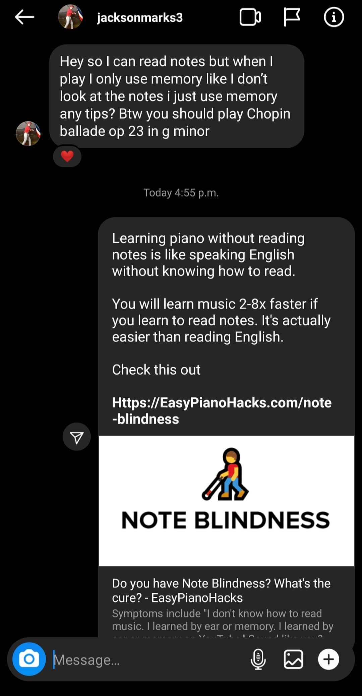

# 💡 How to add FAQs ✅

Here are 3 steps to add [frequently asked questions from Instagram ](https://www.instagram.com/easypianohacks/)to the FAQ:

## Step 1: Copy

Go to Story Saver   
[`https://www.storysaver.net/`](https://www.storysaver.net/)

Type in:

```text
easypianohacks
```

Check the box **"I'm not a robot"**

Scroll down and Select **Highlights**


**What if the page doesn't load?** Sometimes the highlights don't load. Refresh the page and try again. Otherwise 


Here are the Piano Q&A Highlights that need to be added \(you can check these boxes once finished\).

* [ ] Highlight 9
* [ ] Highlight 10
* [ ] Highlight 11
* [ ] Highlight 12
* [ ] Highlight 13
* [ ] Highlight 14
* [ ] Highlight 15
* [ ] Highlight 16
* [ ] Highlight 17
* [ ] Highlight 18
* [ ] Highlight 19
* [ ] Highlight 21
* [ ] Highlight 22

Look for questions and answers in the chat like this:



## Step 2: Paste 

### a. Paste the question into [Gitbook \(login here\)](https://app.gitbook.com/login)


Choose the appropriate category \(this requires your expertise\)



Use the dropdown for different text:



**Heading 1** for Question  
**Heading 2** for Steps like 1, 2, 3, or Sub Categories  
**Heading 3** for Sub Headers  
  
Look at the examples already in the FAQs



For example:



**Made a mistake?** Use CTRL + Z to undo


| Action | Shortcut |
| :--- | :--- |
| Copy | CTRL + C |
| Paste | CTRL + V |
| Undo | CTRL + Z |
| Redo | CTRL + SHIFT + Z |
| Save Draft | CTRL + S |
| Merge | Click on Merge |
| Find Text | CTRL + F |
| Show Commands | CTRL + / |


### b. Pasting a Picture

Copy Image &gt; Paste  `CTRL + V`


### 

### c. Pasting a Story Video

Some questions don't make sense without the videos. 

We will need to upload videos to Google Drive and paste the videos. Here's the final result:



#### How to add videos to Gitbook

1. Download the video from StorySaver.


2. Upload the video to [this Google Drive Folder](https://drive.google.com/drive/u/0/folders/10_uw1kXduKJOx95RgO1jKCQ5maa123OD)



3. `Right click` the video file &gt; Get Link &gt; **Copy Link**  


4. Navigate back to Gitbook &gt; Paste `CTRL + V` &gt; **Hit** **`Enter`**

Here's the final result again:




## Step 3: Save

**Save Draft** and **Merge** changes after each question is added.

You can use **`CTRL+S`** to Save Draft fast.

Click on **Merge** to Publish Changes.


